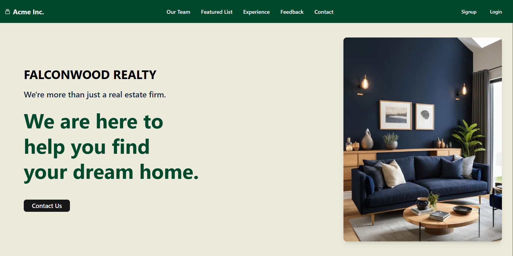

# 🏠 Real Estate Website – Learning Project

A **full-stack real estate web app** built with modern technologies like **Next.js**, **TypeScript**, **Tailwind CSS**, **MongoDB**, and **Prisma**. This project was created **as a learning exercise** to explore full-stack development, user authentication, and responsive UI design using current tools and best practices.

---

## ✨ Features

- 🔐 **User Authentication**: Signup, Login, and Logout functionality with secure credential handling.
- 📦 **MongoDB + Prisma**: User data stored and managed using Prisma ORM with a MongoDB backend.
- 🎨 **Responsive UI**: Styled with Tailwind CSS for a modern, mobile-friendly experience.
- ⚡ **Caching**: Cached frequently accessed data in Redis for a fast user experience and to optimize the cost of Database querying.
- 🛡️ **Robust & Secure Forgot Password endpoint**: Implemented forgot password algorithm via reset link shared over email.
- 🚫 **Rate Limiting**: Added rate limiting to the password reset endpoint, to prevent Brute Force and DoS attacks.
- 🔗 **URL Shortening**: Implemented URL Shortening algorithm using Redis for convenient sharing of the reset password link.
- 🚀 **Deployed on Vercel**: Smooth CI/CD pipeline for hosting and version control.

---

## 🔧 Tech Stack

- **Frontend**: [Next.js](https://nextjs.org/) + [TypeScript](https://www.typescriptlang.org/)
- **Styling**: [Tailwind CSS](https://tailwindcss.com/)
- **Backend & Database**:
  - [MongoDB](https://www.mongodb.com/)
  - [Prisma](https://www.prisma.io/)
- **Deployment**: [Vercel](https://vercel.com/)

---

## 📸 Hero Section Preview

<!-- Replace the URL below with your image path -->

